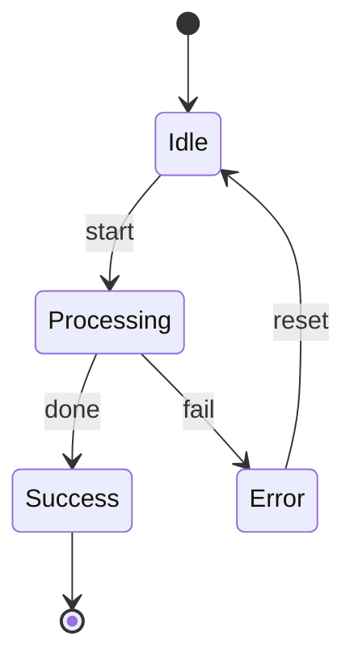

---
title: "Mermaid State Machine"
author: [Author]
date: "2025-01-01"
subject: "Markdown"
keywords: [Markdown, Mermaid, StateMachine]
lang: "en"
toc: false
titlepage: true
titlepage-text-color: "FFFFFF"
titlepage-rule-color: "360049"
titlepage-rule-height: 0
titlepage-background: "background.pdf"
colorlinks: true
...

# State Machine

A simple state machine diagram rendered with Mermaid via Kroki.

**Note:** Mermaid diagrams are rendered as PNG instead of SVG because Mermaid uses HTML `<foreignObject>` for text labels in SVG, which is not supported by LaTeX. As a result, the image quality is lower compared to other diagram types that use SVG.

